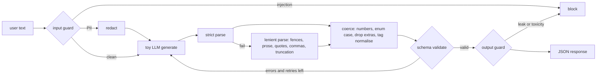

# ai-learn-13-guardrails-structured-output

Day 13 of the AI learning track. This repo implements **guardrails and structured output** from scratch in pure Python. It has a JSON-Schema-like validator, a toy "LLM" that sometimes emits broken JSON, a **validate → repair → retry** loop, and regex-based **input and output filters** (prompt injection, PII, system-prompt leaks, toxicity), each measured on hand-labeled data. There is no network access and no real LLM. It runs in well under a second with seed 42.

## What you'll learn

- How to write a small **schema validator** (type, required, enum, min/max, pattern, items, additionalProperties) that returns readable error paths.
- Which failure modes LLM JSON output really has (fences, prose, single quotes, trailing commas, truncation, wrong types, enum casing, extra or missing fields), and which ones can be **repaired deterministically** and which ones need a **retry with error feedback**.
- Why **valid ≠ correct**: faithfulness to the ground truth is tracked separately from schema validity.
- How to build **input guards** (block injection, redact PII with a Luhn check for cards) and **output guards** (canary-based system-prompt leak detection, toxicity, PII redaction), and how to report their **precision and recall** honestly, misses included.

## Architecture



## Layout

| file | purpose |
|---|---|
| `schema.py` | from-scratch validator and the `TICKET_SCHEMA` used in the experiment |
| `generator.py` | seeded toy LLM with 11 fault types (5 syntax, 6 schema) and error-feedback retries |
| `repair.py` | strict and lenient parsing, schema-guided coercion, `run_pipeline` retry loop |
| `guards.py` | injection regexes, PII regexes (email, phone, card+Luhn, SSN, IP), output guard with canary |
| `labeled.py` | 38 labeled inputs and 12 labeled outputs, including deliberately hard cases |
| `run_smoke.py` | runs 4 strategies × 300 requests plus guard evals and writes `results/` |
| `smoke_plots.py`, `svg_utils.py` | SVG plots and the `RESULTS.md` writer |
| `notebooks/guardrails_walkthrough.ipynb` | step-by-step walkthrough |

## Run

```bash
pip install -r requirements.txt
python run_smoke.py     # < 1 s, rewrites results/
```

## Headline results (seed 42, from `results/metrics.json`)

- Schema-valid rate: **56.3% raw → 91.7% with repair only → 100% with repair + retry**, at 1.09 LLM calls per request (retry alone reaches 96.7% but needs 1.53 calls).
- Faithful rate (valid and equal to ground truth) with repair + retry: **95.3%**. Truncation repair produces valid but incomplete tickets.
- Injection block: precision **100%**, recall **78.6%**. PII detection: P/R **90%/90%**. Output block: precision **100%**, recall **83.3%**.

## Limitations

The regex guards are easy to evade with paraphrase or obfuscation (see `guard_errors` in `results/metrics.json`). The "LLM" is a fault simulator, and the labeled sets are small and hand-written.
